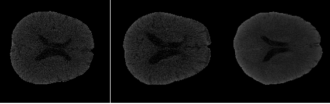
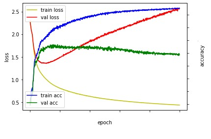

# Lateral Ventricle   

## Overview 
 1. Segmentation Lateral Ventricle
 2. Brain CT data

## Code
 - code_2020020592_한정우.py
 - End to End

## Data
 - Brain CT nifti

### Step 1.
#### Data EDA

 - Goal : 2개의 Lateral Ventricle을 Segmentation
 - 총 600개의 Train과 Test이므로 데이터 수가 적음 -> K-fold
 - 한 개의 뇌에 5층의 image가 있으며(CT data) 합쳐서 3D 데이터 처럼 사용해야 함

### Step 2.
 - 2D Segmentation에서 SOTA에 속하고 있는 U-Net을 적용
 - 마지막 1024를 제거(Computing Power ISSUE)
 - Optimizer : Adam
 - Loss : Categorical cross Entropy
 - Metrics : Accuray

### Step 3.
 - Train : batch 25, cross Validation - 6-fold validation

### step 4.
 - Test : Local Feature, global Feature Issue - Receptive Field Tuning
 - add Data post-processing

