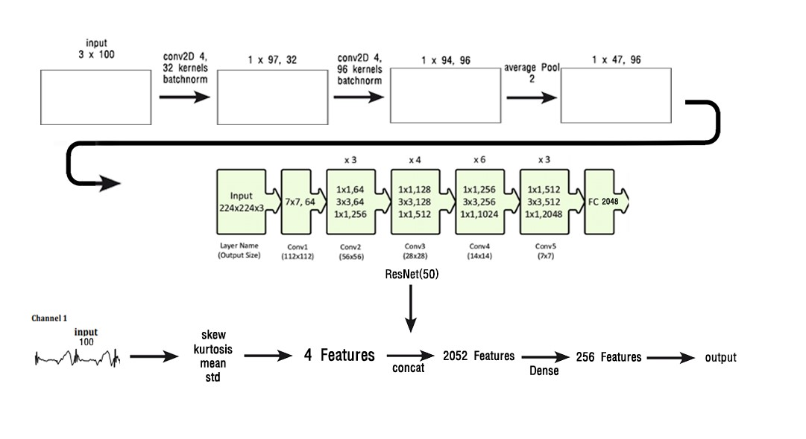
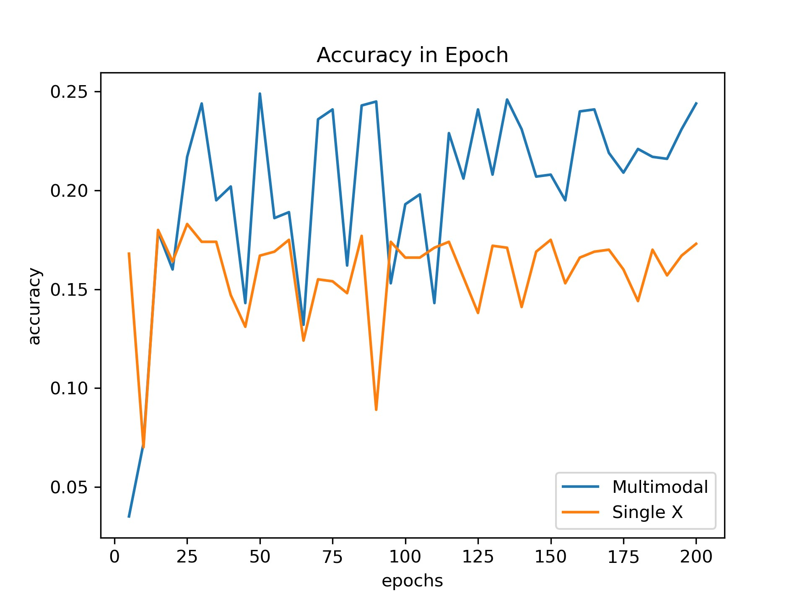
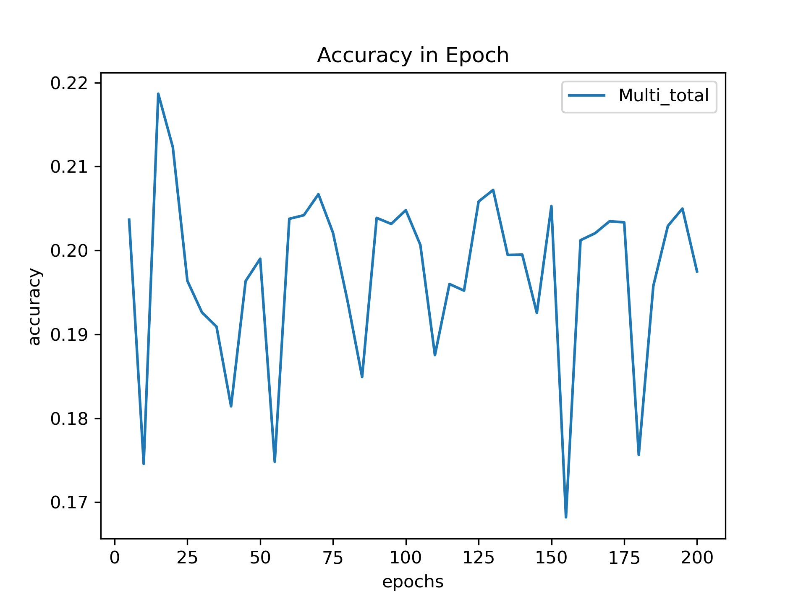
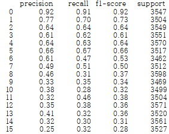
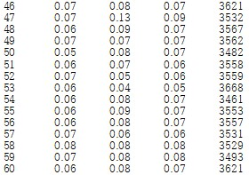
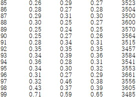
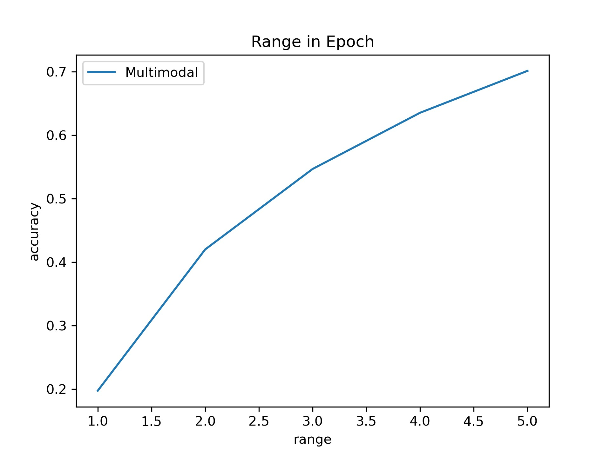

# 멀티모달 설비진단 구현 보고서

## Overview
 - Multi-modal 형태로 모터수명을 진단
 - Image와 TimeSeries 데이터로 사용

## Goal
 - 설비 진단을 위해서 설비의 잔여 수명 및 고장을 예측하고 진단할 수 있도록 하는 방법을 멀티 모달 딥 러닝 기술을 이용해서 수행할 수 있는지 가능성을 제시하는 기술 구현하는 것을 목표
 - 모터는 다양한 설비에 사용되며, 진동 전류 등의 다양한 정보를 모니터링 할 수 있고, 고장의 시점을 예측하는 것이 의미를 갖으므로 모니터의 수명 예측 및 고장 진단을 수행
 - 모터의 고장 시점의 진동 및 전류의 파형 정보를 전체 Lifetime Data에 맞출 수 있으며 고장 시점을 진단해 냈다고 볼 수 있음
 - 그러므로 특정한 구간의 진동 및 전류 데이터를 입력으로 사용하여, 이 구간이 전체 lifetime data에서 어떠한 구간인지를 맞히는 방법을 멀티 모달 딥 러닝 방법을 통해 학습시키는 것을 목표

## Data
 - 진동 데이터에 대한 X, Y, Z 축 3개와 Current 데이터 1개를 설비 진단에 사용
 - 데이터를 100개의 단위로 분할하여 사용
 - X, Y, Z를 2차원 데이터 3 X 100 형태로 변환하여 CNN을 적용
 - Current  데이터 또한 100개의 단위로 분할하여 Skew, Kurtosis, mean, std에 대한 Feature를 추출하여 2D의 Feature에 concat하게 됨

## Model
 - 3 X 100 형태로 변환 되어 있는 데이터에 대해 conv2D(32, 4)를 적용하여 32개에 대한 Feature를 뽑은 뒤 Batch Normal을 하게 된다.
 - 이후에 반복적이게 적용을 한 뒤, Average Pooling을 한다(실험적인 결과로 Max하게 되면 Outlier에 영향을 많이 받음)
 - 이후에 CNN의 분류영역에서 높은 정확도를 인정받고 있는 ResNet(50)을 적용
 - ResNet의 Output으로는 총 2048개의 Feature가 나오게 되고, Current 데이터의 Feature 4개와 합치게 되어 2052개의 Feature를 추출하여 Dense Layer를 통해 1개의 output을 만들게 된다.

## Metrc
 - 진동 데이터를 input으로 넣어주게 되면 같은 파형의 유무와 어느 시점의 데이터인지 찾아야 한다.
 - 사용되는 데이터기 시계열 데이터 이므로 총 100개의 구간으로 나누어 Class를 이루게 하여 1개의 output으로 Class를 맞추는 형태로 학습을 하게 된다.

## Vs Single Data
 - 멀티 모달 형태의 모델을 학습하게 된다면 25 Epoch 이후에 15%~24%의 정확도를 반복하게 되며 학습이 진행되면서 약 24%에 수렴한다. 
 - 반면에 단일 데이터 모델의 경우에는 7%~17%의 정확도를 반복하게 되며 약 17%의 정확도에 수렴하게 된다.

## more Data
 - 전체 데이터(v1 + v2 + v3)를 랜덤으로 Train과 Test 셋으로 나누어 반복적으로 학습한 결과
 - Overfitting이 부분적으로 해결이 되면서 정확도는 17%~22%를 반복하게 되고 학습이 진행되면서 약 20%에 수렴하게 된다

## Section Accuracy
 - 처음과 끝은 정확도가 높은 편이나 중간의 정확도는 낮다. 왜냐하면 중간은 일정한 패턴이 지속되는 구간이고 처음과 끝은 특수한 패턴을 지니고 있다.

## Range Accuracy
 - 실제 고장 시점을 예측한다고 했을 때, 정확한 구간을 예측하는 것이 가장 좋겠지만 실제 고장시점에서 조금 이르거나 늦은 부분을 예측하여도, 완전히 틀렸다고 할 수 는 없음
 - 이러한 경우를 테스트 하기 위해, 맞춘 것으로 판단되는 구간의 범위를 늘려가며 range에 따른 영향을 시험
 - Range가 1일 경우, 예측 결과가 50이라고 했을 때, 실제 49~51 사이에 있다면 올바르게 예측한 것으로 본다.
 - Range를 5까지 늘렸을 때, 최대 70%까지 정확도가 나오게 된다

## Result
 - 일반적인 단일 데이터의 모델로는 진동 데이터를 Classification 하기 어렵지만, 여러 개의 데이터를 통합하는 멀티 모달 형태의 모델을 적용한다면 약 70%의 정확도를 나타내고 있기 때문에 데이터의 형태만 가지고 어느 시점 데이터인지 파악할 수 있다.
 - 더 많은 데이터와 각각 데이터에 맞는 모델을 만들게 된다면 더 높은 정확도를 얻을 수 있을 것으로 보이고 고장 진단 산업에 적용 가능해 보인다.