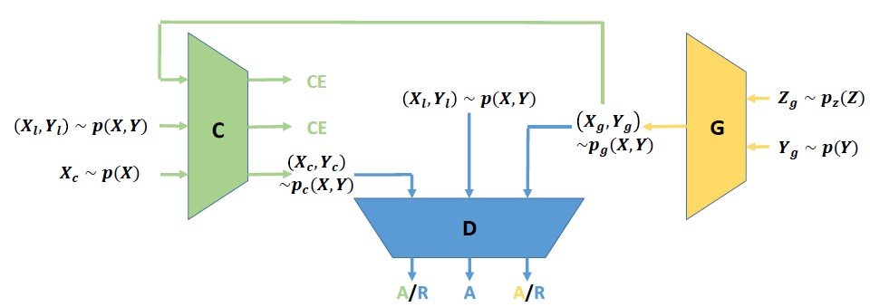
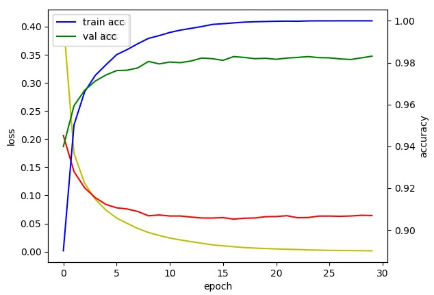
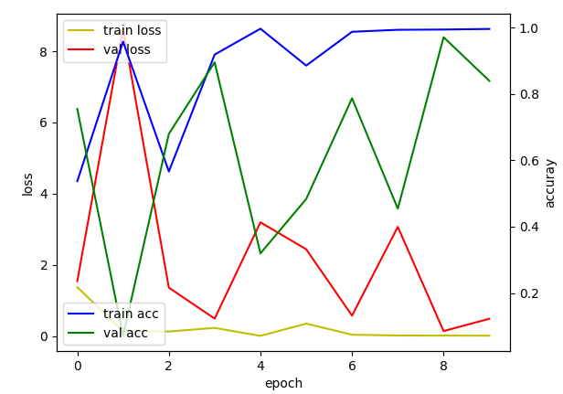
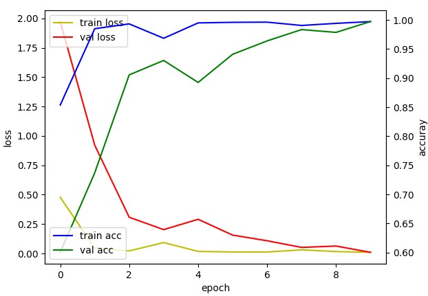

# OCT image CNN Retinal Disease Prediction with Triple GAN
## AI healthcare Project 3
Goal : 기존의 논문을 새로운 기술(Triple GAN)을 적용하여 더 좋은 결과를 도출

## Overview
 1. OCT image CNN Retinal Disease Prediction with Triple GAN
 2. solve data imbalance problem by Triple GAN
 3. Segmentation task on Retinal Image

## Introduce
 논문[1]은 3D OCT images를 segmentation하여 Tissue-segmentation map 형태 Classification을 하게 된다. 두번의 network를 거치게 하는 것(Clinical application in AI architecture)과 자신만의 데이터 구축(Manually Segmented, referred to hospital)을 통해 학습한 모델을 기존 OCT image에 적용하면 높은 정확도가 나온다는 것

## Approach
 데이터 구축(Segmentation)을 Triple GAN을 통해 생성한다
 - 논문에서 사용한 데이터를 구하지 못하여, 다음 Approach로 전환(12.14)
 현재의 Model을 Triple GAN 형태로 바꾼다
 - Segmented Data가 너무 제한적이라, 논문의 구조를 적용하기 힘듦(12.17)
 2D OCT Data는 Data imbalance의 문제가 있다. 이것을 Triple GAN으로 해결
 - 현재 주어진 데이터의 Class imbalance가 굉장히 심함

|데이터|개수|비율|
|:---:|:---:|:---:|
|AMD|429|0.0039|
|CNV|37,205|0.3421|
|DME|11,348|0.1043|
|DRUSEN|8,616|0.0792|
|NORMAL|51,140|0.4703|
|SUM|108,738|1|

OCT 2017 Datasets + OCT 2017 AMD

 - 이러한 문제를 Triple GAN을 통하여, imbalance를 해결한다면 정확도의 향상이 있음[3]
 - 각 구조를 학습시켜, auxiliary Datasets을 만들어 Classification Model에 적용[2]
   - Generator - Image Decoder
   - Classifier - Labeling Data
   - Discriminator - foree to generate data

## Process
 학습 정의
 - Data에 따라 정확한 판단을 하여야 하기 때문에 정해진 Backbone을 사용, Classfication에서 SOTA의 성능을 나타내고 있는 ResNet을 사용
 - Data의 작은 형태를 고려하여, 모두 K-fold Validation 적용, Batch size = 100, loss = categorical_crossentropy, optimizer = adam, metrics = accuracy
 - 데이터가 독립변인, auggmentation을 적용하지 않음
 - 10만개 이상의 jpg를 사용하기에, (224, 224) Grayscale로 학습
 - 2017 OCT에 각 400개씩 Test Set

 Data Imbalance 확인
 - 데이터가 균형일 때

|데이터|개수|비율|
|:---|---:|:---:|
|AMD|400|0.2|
|CNV|400|0.2|
|DME|400|0.2|
|DRUSEN|400|0.2|
|NORMAL|400|0.2|
|SUM|2,000|1|

 Accuracy : 0.9850 

가정 : 데이터가 Balance 하다면, 학습이 가능한 형태의 데이터이다.

 - 데이터가 불균형일 때
|데이터|개수|비율|
|:---|---:|:---:|
|AMD|429|0.0039|
|CNV|37,205|0.3421|
|DME|11,348|0.1043|
|DRUSEN|8,616|0.0792|
|NORMAL|51,140|0.4703|
|SUM|108,738|1|

 Accuracy : 0.5665

가정 : 데이터가 imbalance 하다면, 학습이 어려운 행태의 데이터이다.

 - Triple GAN으로 만든 데이터를 Auxiliary 하였을 때

|데이터|개수|비율|
|:---|---:|:---:|
|AMD|12,892|0.10|
|CNV|38,000|0.30|
|DME|12,000|0.09|
|DRUSEN|1,000|0.08|
|NORMAL|51,500|0.40|
|SUM|124,392|1|

 Accuracy : 0.8008

## Results
 - Data Imbalance 문제는 의료데이터에서 주로 많이 발생하며, 그것을 해결하기 위해 sampling, bagging, boosting 등 다양한 기법을 적용한다[5]
 - Auxiliary 데이터를 위해, Triple GAN을 적용하였는데 유의미한 결과가 도출
 - Data가 부족한, 불균형한 곳에 Triple GAN을 사용하여 해결할 수 있다.

## Reference

[1] OCTimage CNN RetinalDiseasePrediction

[2] Triple Generative Adversarial Nets

[3] Classification with class imbalance problem : SOCO 2015, Computer Science, A.Ali, S.Shamsuddin, A.Ralescu

[4] https://github.com/taki0112/TripleGAN-Tensorflow

[5] A Survey on Methods for Solving Data imbalance Problem for Clasffication
